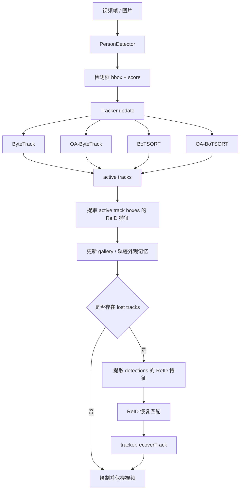
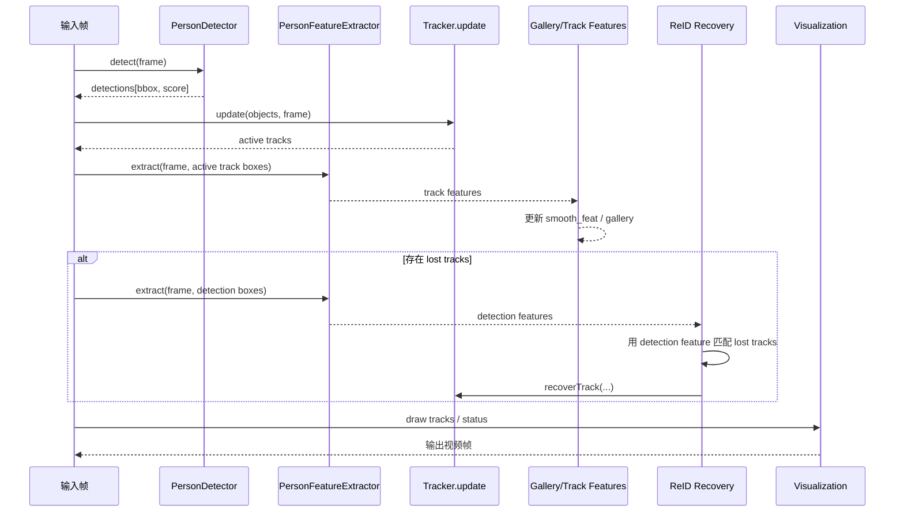

# rknn_det_track_reid

面向端侧的视频检测、跟踪、ReID 联调工程。

这个仓库当前的重点不是训练，而是把下面几类模块在同一条视频处理链路里接起来，并能在端侧直接验证效果：

- 检测：`PersonDetector`
- 跟踪：`BYTETracker` / `OA-ByteTrack` / `BoTSORT` / `OA-BoTSORT`
- ReID：`PersonFeatureExtractor`
- 统一测试入口：`tools/tracker_test.cpp`

当前代码已经做过多轮联调，README 以下内容以**当前代码真实行为**为准。

## 1. 工程目标

这个工程的用途是回答几个非常具体的问题：

- 检测器在端侧视频上的框稳定性如何
- 四种跟踪器在同一视频上的 ID 连续性如何
- ReID 模型本身有没有区分力
- ReID 接入跟踪后，到底在什么阶段起作用
- 镜头抖动、框偏移、短时漏检时，链路是否还能把同一个人接上

所以它不是一个纯算法仓库，也不是机器人主工程的子模块，而是一个**可独立编译、独立测试、独立出视频结果**的联调工程。

## 2. 当前目录结构

```text
rover_vision_module_lab/
├── CMakeLists.txt
├── README.md
├── config/
│   └── parameters.yaml
├── include/
│   ├── config.hpp
│   ├── detector.hpp
│   ├── gallery_manager.hpp
│   ├── module_test_utils.hpp
│   ├── personfeature_extractor.hpp
│   ├── rknn_api.h
│   └── tracker/
│       ├── BYTETracker.h
│       ├── BoTSORT.h
│       ├── GMC.h
│       ├── KalmanFilter.h
│       ├── Object.h
│       ├── OcclusionAware.h
│       ├── Rect.h
│       ├── STrack.h
│       └── lapjv.h
├── src/
│   ├── detector.cpp
│   ├── gallery_manager.cpp
│   ├── personfeature_extractor.cpp
│   └── tracker/
│       ├── BYTETracker.cpp
│       ├── BoTSORT.cpp
│       ├── GMC.cpp
│       ├── KalmanFilter.cpp
│       ├── Object.cpp
│       ├── OcclusionAware.cpp
│       ├── Rect.cpp
│       ├── STrack.cpp
│       └── lapjv.cpp
├── test/
├── tools/
│   ├── detector_test.cpp
│   ├── pipeline_test.cpp
│   ├── reid_test.cpp
│   └── tracker_test.cpp
└── tracker/
```

注意：根目录下还有一个 `tracker/` 目录，那是 Python 参考实现。  
当前 C++ 代码的联调逻辑已经大量参考这个 Python 版本，但并不是简单逐行翻译。

## 3. 依赖

- OpenCV
- Eigen3
- RKNN Runtime `librknnrt.so`

`CMakeLists.txt` 中会链接：

- 检测模型所需 RKNN runtime
- ReID 模型所需 RKNN runtime
- OpenCV 相关图像/视频能力

## 4. 编译

在工程根目录执行：

```bash
cmake -S . -B build
cmake --build build -j4
```

如果 RKNN 运行库不在默认路径，可以覆盖：

```bash
cmake -S . -B build -DRKNN_LIB=/your/path/librknnrt.so
```

## 5. 配置文件

统一配置文件：

```text
config/parameters.yaml
```

当前已经把三种 tracker 的默认参数全部放进配置里，而不是继续写死在代码中。

### 5.1 检测参数

- `detect_rknn_model`
- `detect_class_num`
- `detect_image_width`
- `detect_image_height`
- `detect_score_threshold`
- `nms_iou_threshold`

### 5.2 跟踪参数

#### ByteTrack

- `bytetrack_track_buffer`
- `bytetrack_track_thresh`
- `bytetrack_high_thresh`
- `bytetrack_match_thresh`

#### BoTSORT

- `botsort_track_buffer`
- `botsort_track_thresh`
- `botsort_high_thresh`
- `botsort_new_track_thresh`
- `botsort_match_thresh`
- `botsort_gmc_method`

#### OA-BoTSORT

- `oabotsort_track_buffer`
- `oabotsort_track_thresh`
- `oabotsort_high_thresh`
- `oabotsort_new_track_thresh`
- `oabotsort_match_thresh`
- `oabotsort_gmc_method`
- `oabotsort_use_oao`
- `oabotsort_use_bam`

### 5.3 ReID 参数

- `person_reid_rknn_model`
- `person_similarity_threshold`

### 5.4 配置与命令行覆盖关系

`tools/tracker_test.cpp` 里当前逻辑是：

- tracker 的默认值先从 `parameters.yaml` 读取
- 如果命令行传了 `--track-thresh / --high-thresh / --match-thresh / --track-buffer`
- 则这些值会覆盖配置中的对应字段

也就是说：

- 不传命令行参数：按配置文件跑
- 传了命令行参数：以命令行为准

## 6. 当前模块如何衔接

这是当前工程最关键的部分。

### 6.1 总体处理链路

在 `tools/tracker_test.cpp` 里，当前统一链路是：

```text
视频帧
  -> PersonDetector
  -> tracker.update(...)
  -> 轨迹输出 active tracks
  -> 对 active tracks 批量提 ReID 特征
  -> 更新 gallery / track feature
  -> 如果有 lost tracks，再对 detections 批量提 ReID 特征
  -> 做 ReID 恢复
  -> 可视化并保存视频
```

这条链路是四种 tracker 共用的。

### 6.1.1 模块衔接流程图



### 6.1.2 单帧时序图



### 6.2 检测模块如何工作

入口函数：

- `detect_frame(PersonDetector&, const cv::Mat&)`

处理顺序：

1. 从 `parameters.yaml` 读取检测输入尺寸
2. 对原始帧做 letterbox resize
3. 调 `PersonDetector::detect`
4. 把检测框从 detector 输入坐标映射回原图坐标
5. 转成 `byte_track::Object`

检测模块只负责：

- 找到人
- 给出框和分数

它不负责：

- ID 分配
- 轨迹维护
- ReID 恢复

### 6.3 ReID 模块如何工作

ReID 的特征提取入口在：

- `PersonFeatureExtractor::extractFeature`
- `PersonFeatureExtractor::extract(frame, boxes)`

当前主测试链路已经改成更接近 `reid_test` 的方式：

- 不再在 `tracker.update` 之前对每个 detection 全量提特征
- 而是：
  1. 先纯检测 / 跟踪
  2. 对 `active tracks` 批量提特征并更新 gallery
  3. 只有存在 `lost tracks` 时，才对当前 detections 批量提特征做恢复

所以当前代码里，ReID 主要用于：

- 轨迹外观记忆更新
- `lost` 轨迹恢复

### 6.4 Object 与 STrack 如何承接 ReID 特征

当前 C++ 结构已经扩展过：

- `Object` 多了 `feature`
- `STrack` 多了：
  - `curr_feat_`
  - `smooth_feat_`
  - `features_`

`STrack` 在以下时机会更新特征：

- 构造时带 feature
- `update(...)`
- `reActivate(...)`

并且使用 EMA 做平滑：

```text
smooth_feat = alpha * smooth_feat + (1 - alpha) * curr_feat
```

这意味着：

- detection feature 会逐帧沉淀成轨迹级 feature
- 后续 ReID 恢复不只用单帧特征，而是用平滑后的轨迹外观

### 6.5 三种 tracker 主关联的差别

#### ByteTrack

特点：

- 两阶段关联
- 主关联仍然是位置/运动优先
- 当前版本已经额外加入 motion consistency cost

当前行为：

- 高分框先和 tracked/lost pool 做第一轮匹配
- 低分框再做第二轮匹配
- ReID 不主导 ByteTrack 的主关联

#### BoTSORT

特点：

- 有 GMC
- 有两阶段匹配
- 当前版本已经按最近一次调整，把主关联里的 ReID 去掉
- 主关联现在主要靠：
  - GMC 补偿后的空间一致性
  - IoU
  - motion consistency cost

ReID 在 BoTSORT 中现在主要用于：

- detection feature 写入 track
- lost 轨迹恢复

#### OA-BoTSORT

特点：

- 在 BoTSORT 基础上叠加：
  - OAO
  - BAM

当前主关联顺序：

1. GMC
2. 高置信主关联
3. OAO refine spatial consistency
4. 低置信第二轮关联
5. BAM 做更新修正
6. 外层 ReID 恢复 lost 轨迹

### 6.6 当前 ReID 什么时候真正起作用

这是最容易误解的地方。

当前工程里，ReID 的作用分两层：

#### 第一层：每帧都提 detection feature

这一步每帧都做，但不代表每帧都强影响最终 ID。

它的作用是：

- 给后续 track feature 更新提供原料
- 给 lost 恢复提供匹配依据

#### 第二层：lost 轨迹恢复

这才是 ReID 当前最明确、最稳定的介入点。

外层流程会：

1. tracker 先输出 `active_tracks`
2. active tracks 和 detections 做 IoU 对齐
3. 用这些 detection feature 更新 gallery
4. 如果存在 `lost_tracks`
5. 再用 `gallery + detection feature` 去恢复 lost
6. 命中后调用 tracker 的 `recoverTrack(...)`

所以可以把当前 ReID 理解成：

- 不是“主导每一帧关联”
- 而是“给轨迹维护外观记忆，并在断链后尝试接回旧 ID”

### 6.7 当前 video 链路里，镜头抖动问题是怎么处理的

针对你之前反馈的：

- 镜头晃动大
- 框整体平移
- IoU 很低
- 明明同一个人却换号

当前工程已经做了两层补丁：

#### 1. GMC

`BoTSORT/OA-BoTSORT` 里会先估计全局仿射变换，用它补偿相机运动。

#### 2. Motion Consistency Cost

即使 GMC 不完全准确，也不会只靠 IoU 一刀切。

当前代价里还会看：

- bbox 中心位移
- bbox 尺寸变化

如果：

- IoU 低
- 但中心位移和尺度仍合理

就允许这对轨迹/检测继续被视为“可能是同一个人”。

这就是当前工程相对 Python 参考实现的一个重要工程化增强。

## 7. 当前工程与 `/home/armsom/cc/reid_test` 的关系

当前工程是基于参考项目的思路做的 C++ 端侧版本，但不是逐行翻译。

### 一致的地方

- 检测 → 跟踪 → gallery → ReID 恢复 的大框架一致
- ReID 主要服务于 lost recovery 的思路一致
- `BoTSORT/OA-BoTSORT` 当前主关联不再强依赖 ReID

### 不一致的地方

- 当前工程加入了 motion consistency cost
- 当前工程的 GMC 做了质量判定和回退
- 当前工程配置文件是扁平结构，不是 Python 那种嵌套 yaml
- 当前工程目前测试和业务入口统一在 `tracker_test.cpp`

## 8. 工具说明

### 8.1 `detector_test`

只测检测，不做跟踪，不做 ReID 恢复。

适合看：

- 检测框稳定性
- 漏检情况
- 低分框是否还存在

### 8.2 `reid_test`

只测 ReID 模型本身。

适合看：

- 两张 crop 的余弦相似度
- 一个 query 在 gallery 里的排序

它不涉及：

- 卡尔曼预测
- IoU 关联
- lost 恢复

### 8.3 `tracker_test`

这是当前最重要的入口。

它负责：

- 在线检测
- ReID 特征提取
- 三种 tracker 联调
- lost 轨迹恢复
- 视频导出
- 轨迹 CSV 导出

如果要验证端侧实际效果，优先跑它。

### 8.4 `pipeline_test`

它更偏“指定目标 / gallery / ReID 检索”的实验入口，不是当前三种 tracker 横向对比的主入口。

## 9. 常用命令

### 9.1 跑当前配置下的三种 tracker

```bash
./build/bin/tracker_test --input test/test.mp4 --tracker bytetrack --output test/out_bt.mp4
./build/bin/tracker_test --input test/test.mp4 --tracker botsort --output test/out_bs.mp4
./build/bin/tracker_test --input test/test.mp4 --tracker oabotsort --output test/out_oa.mp4
```

### 9.2 导出逐帧轨迹 CSV

```bash
./build/bin/tracker_test \
  --input test/test.mp4 \
  --tracker botsort \
  --dump-tracks test/botsort_tracks.csv \
  --output test/botsort.mp4
```

CSV 格式：

```text
frame,track_id,x1,y1,x2,y2,score
```

### 9.3 单独测 ReID

```bash
./build/bin/reid_test --query query.jpg --candidate candidate.jpg
./build/bin/reid_test --query query.jpg --gallery ./gallery_dir
```

## 10. 当前代码的关键结论

基于目前多轮联调，当前工程的结论不是抽象的，而是很具体：

- ReID 模型本身有一定区分力，但还不够强
- 当前系统里，真正主导 ID 连续性的仍然是：
  - 检测框连续性
  - GMC 稳定性
  - IoU/运动一致性
- ReID 更像辅助模块，尤其体现在 lost recovery 上
- 对镜头晃动视频，简单增加 ReID 并不一定更稳
- 更有效的是：
  - 稳定 GMC
  - 放宽合理的低分框接入
  - 用 motion consistency cost 兜住大平移

## 11. 运行注意事项

- 请从工程根目录启动，避免相对路径失效
- `test/` 目录里会积累很多视频和 CSV，长期使用建议定期清理
- `tracker_test` 在长视频上运行时间较长，尤其是三条 tracker 全部重跑时
- `video-11.mp4` 这种长视频拼接建议使用 OpenCV 逐帧合成，避免 `ffmpeg` 的时间基问题

## 12. 推荐阅读顺序

如果你要快速理解当前工程，建议按这个顺序看：

1. `config/parameters.yaml`
2. `tools/tracker_test.cpp`
3. `src/detector.cpp`
4. `src/personfeature_extractor.cpp`
5. `src/tracker/STrack.cpp`
6. `src/tracker/BYTETracker.cpp`
7. `src/tracker/BoTSORT.cpp`
8. `src/tracker/GMC.cpp`

这样最容易把“数据怎么流动”看清楚。
